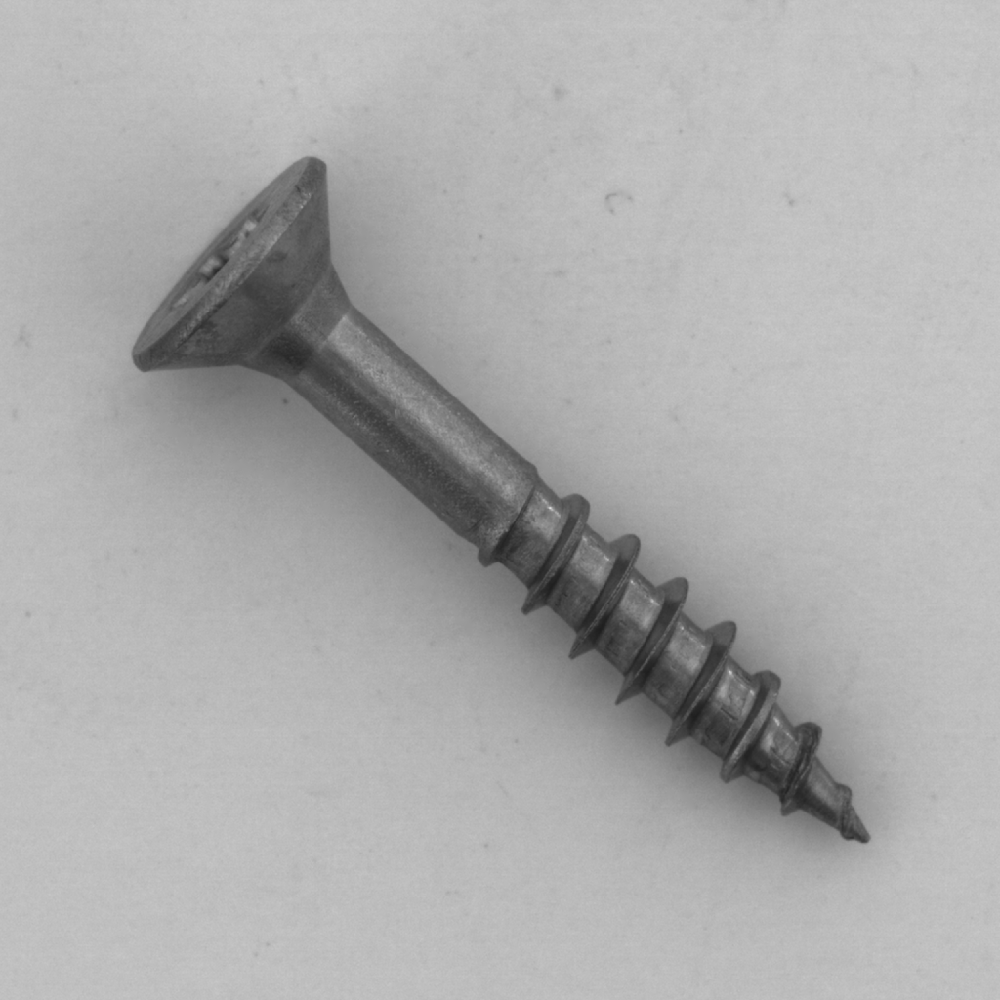
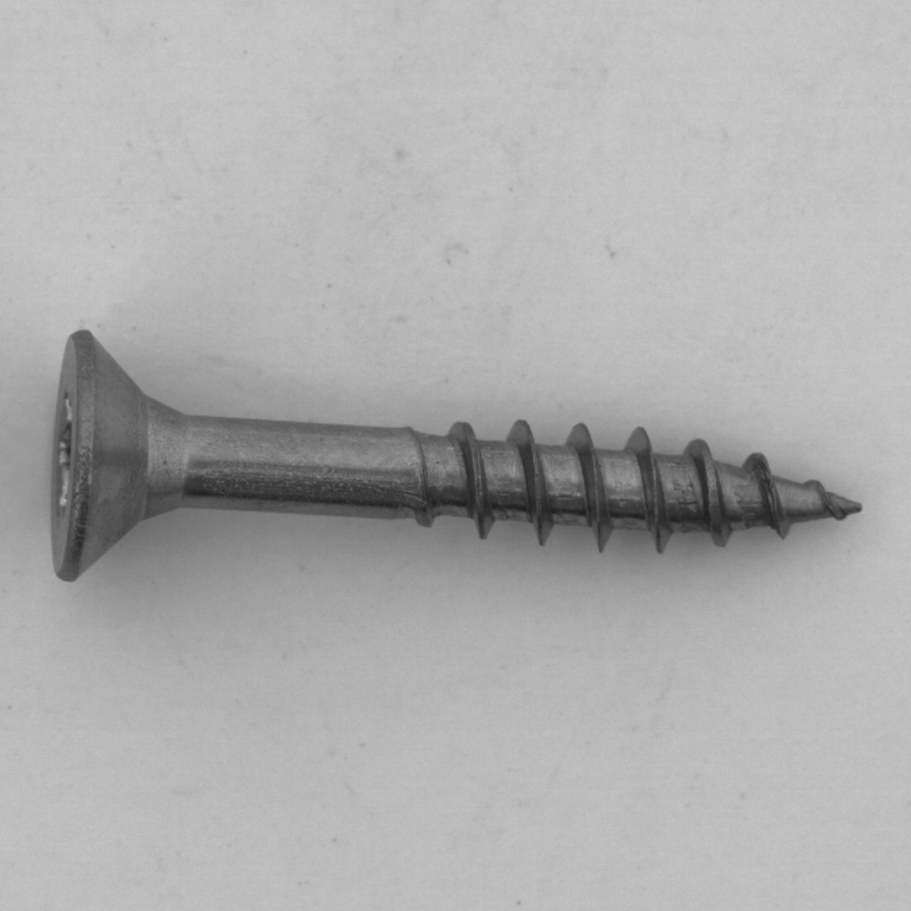
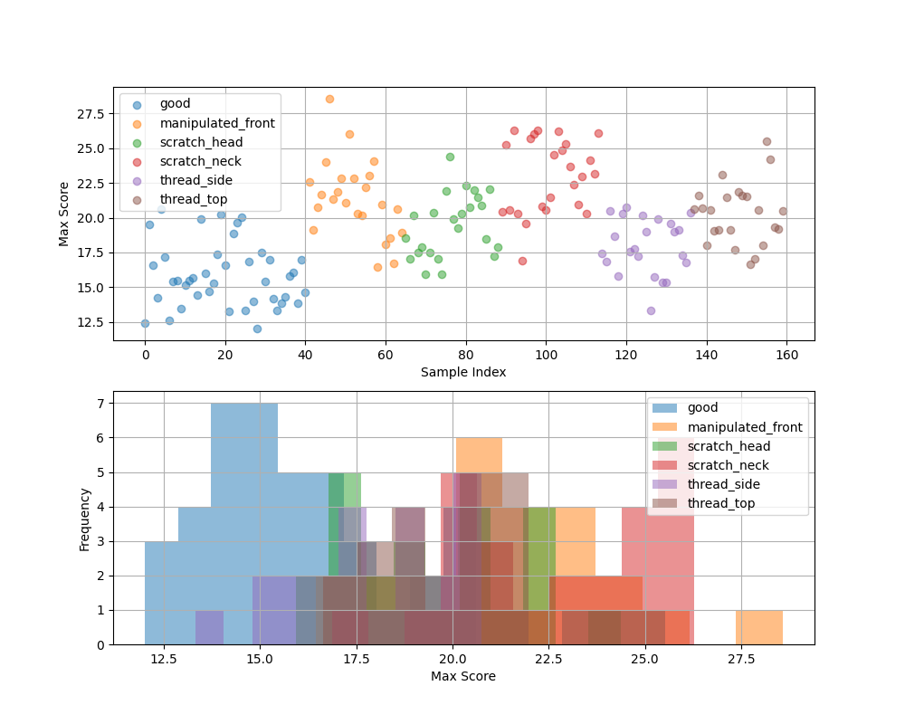
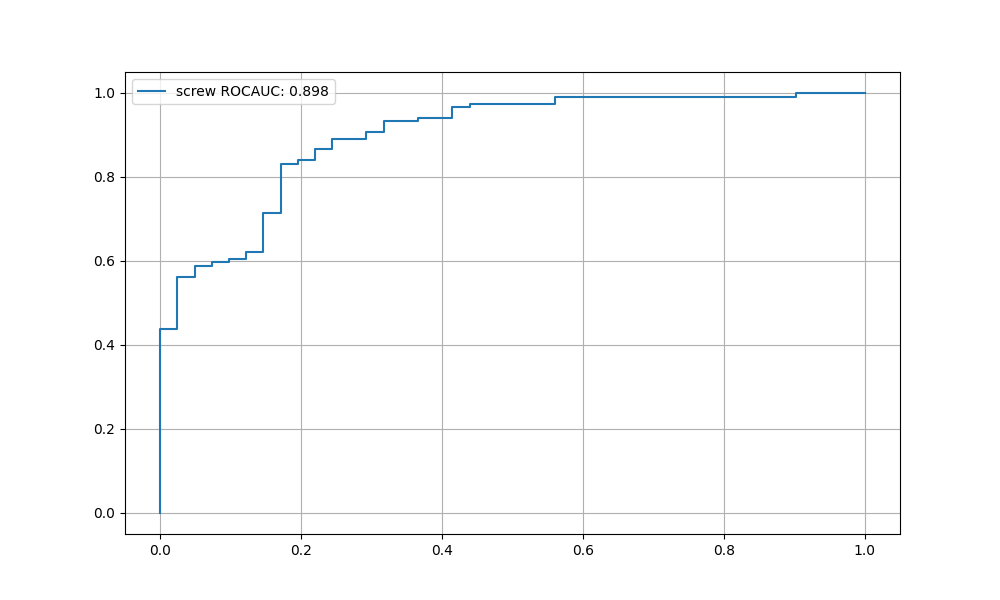
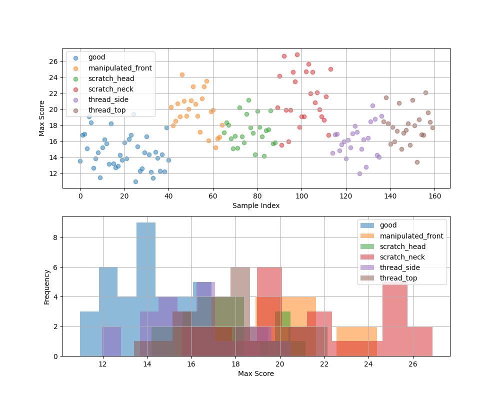
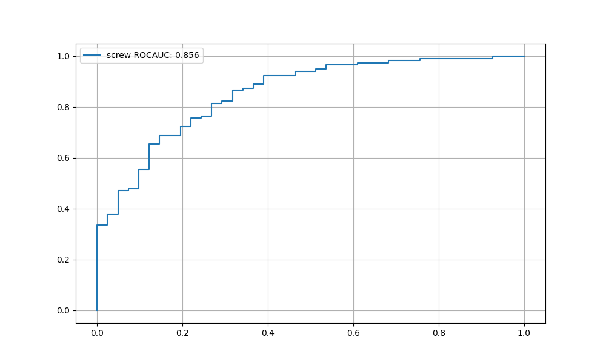

# MVTec AD screwの異常検知
## データのインストール
[こちら](https://www.mydrive.ch/shares/38536/3830184030e49fe74747669442f0f282/download/420938130-1629953152/screw.tar.xz)からインストール
### データの例

    
    

## 手法
- [PaDim](https://arxiv.org/abs/2011.08785)を使用した
- コードは[こちら](https://tech.anytech.co.jp/entry/2023/03/23/100000)を参考にした
- [この論文](https://openaccess.thecvf.com/content/CVPR2023W/VAND/papers/Heckler_Exploring_the_Importance_of_Pretrained_Feature_Extractors_for_Unsupervised_Anomaly_CVPRW_2023_paper.pdf)を参考にして、適切な特徴レイヤーの選択をした
- ねじが向いている方向がバラバラであり、PaDimは移動や回転などの位置ずれに関して弱いという性質があるため、特徴点マッチングを使用して、ある画像のねじの向きに他の画像のねじの向きを合わせることで精度が上がるのかを試した

## 結果
### 特徴レイヤーの選択
- 今回はPaDimのバックボーンにWideResNet50-2を使用した
- デフォルトではWideResNetのlayer1, layer2, layer3の最後の特徴マップを使用して特徴量を取得する構造
- 適切な特徴マップを取得することが精度向上につながるのので、取りうるすべての特徴マップの組み合わせを試して、どの組み合わせが最もこのタスクにおいて精度が高くなるのか検証（`tuning.py`）

| layer1_index  | layer2_index | layer3_index | rocauc    |
|:-------------:|:------------:|:------------:|:---------:|
| 2             | 3            | 3            | **0.8981**|
| 0             | 3            | 3            | 0.8979    |
| 0             | 3            | 1            | 0.8971    |
| 2             | 3            | 1            | 0.8961    |
| 0             | 3            | 4            | 0.8959    |
| 2 (default)| 3            | 5            | 0.8839    |

- 最も精度が高い組み合わせの結果を以下に示す

    
    
異常値スコアと出現頻度

    
    
ROCカーブとAUC

### 特徴マッチングを用いたねじの向き合わせ
- 訓練画像の`000.png`を参照画像とし、ORBを用いて特徴点を取得
- 各訓練画像とテスト画像は参照画像と特徴点マッチングを行い、90°単位で最適な回転角度を決定し、画像を回転させる
- 結果を以下に示す

| layer1_index  | layer2_index | layer3_index | rocauc    |
|:-------------:|:------------:|:------------:|:---------:|
| 0             | 2            | 1            | 0.8557    |
| 0             | 2            | 0            | 0.8549    |
| 0             | 3            | 1            | 0.8537    |
| 0             | 1            | 0            | 0.8532    |
| 0             | 3            | 0            | 0.8524    |
| 2 (default)| 3            | 5            | 0.8317    |

- 最も精度が高い組み合わせの結果を以下に示す

    
    
異常値スコアと出現頻度

    
    
ROCカーブとAUC

## やり残し
- ねじの向き合わせで精度が下がることの考察
- 画像のリサイズとバックボーンの影響
- PatchCore
  - SOTAなのでまずこっちをやればよかった
